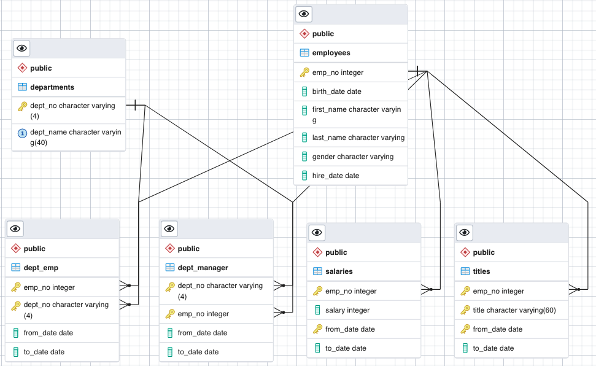
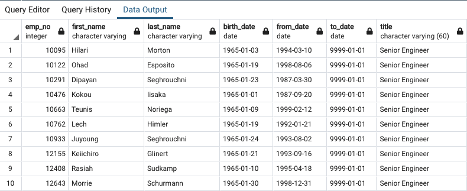
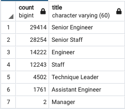

# Pewlett Hackard Analysis

Programming Software/Language Used: SQL, PostgreSQL, pgAdmin4

# Overview: 

Using SQL Pewlett Hackard is offering a retirment package and is forecasting for the future of the company for veteran employees offered retirement packages and how they will fill the open roles of the retirees.

Thousands of Jobs will be available, and in this analysis we find the answers to generate future job openings, mentorship candiates

# Results: 

ERD(Entity Relationship Diagram)

Mentorship Eligibity 

Out of the eligible employees, there are 402 Engineers, 392 Senior Staff, 332 Staff, 290 Senior Engineers, 77 Technique Leaders, and 56 Assistant Engineers.

Unique Titles 

The most common titles vary from Senior Engineer, Senior Staff, Staff, and Engineer.

Future Job Openings

Out of those employees leaving, there are 29,414 Senior Engineers, 28,254 Senior Staff, 14,222 Engineers, 12,243 Staff, 4,502 Technique Leaders, 1,761 Assistant Engineers, and 2 Managers.

# Summary: 

How many roles will need to be filled as the "silver tsunami" begins to make an impact? 

Are there enough qualified, retirement-ready employees in the departments to mentor the next generation of Pewlett Hackard employees?

